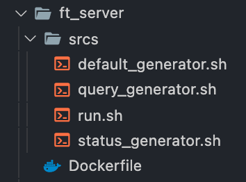

# 0. Guide Link

* [Guide Link](https://bigpel66.oopy.io/library/42/inner-circle/6)

# 1. What is ft_server?

This project is the Monolithic Nginx Web Server which has following services WordPress, MySQL, phpMyAdmin. This is so called as LEMP Stack.

# 2. How to use the given files?

The given `Dockerfile` can be built as an Image by using the listed command below.
> docker build -t \<image-name> \<context>

If there is no option `-t`, it is always have to use the ID value of the image. \<context> is used as the path to find the `Dockerfile` and other files. When the command is used on the current path which has `Dockerfile` with other files and the name of the image is determined to be `ft_server`, you have to use `docker build -t ft_server .`

# 3. Directory Structure?

\* Every detail is specified on each script.

    

### Dockerfile
* The collections of many commands to build a image for the server.

### srcs/default_generator.sh
* The config file which does not have sensitive data like username, password to setup the Nginx. The sensitive data are given by arguments of the script.

### srcs/query_generator.sh
* The file which holds SQL to create Database named by arguments of the script. As mentioned before, the sensitive data are given by arguments of the script.

### srcs/status_generator.sh
* After creating Database like WordPress and phpMyAdmin, the list of Databases are shown by this script.

### srcs/run.sh
* When Built Image becomes Container by the `docker run ...` command, this script will be executed. The sensitive data used in this script will be from the configured ENV variables on the `Dockerfile` which are given by user on `docker build ... ` command.

# 4. Server Structure?

    

# 5. Features

1. There are no sensitive data on every script. The user who is building the image through `Dockerfile`, will give the all sensitive values through ARG Command. These values will be set as Environment Variables by ENV Command on the `Dockerfile`. When the container creates and runs, the server will be configured by Environment Variables and will be removed at the end of the setting the server. This leads to the `Stateless Server`.

2. If there is no file which matched to the `index` Directive on the `default` of Nginx, the Web Page will be shown according to the `autoindex` Directive. When it is enabled, the available files will be shown as a list. If it is not, forbidden phrases will be shown.

3. All of the configuration files which are necessary to setup the services will be copied from the sample files when installing each services.

4. This server use the Root CA as a localhost to get a SSL Certificate to communicate on HTTPS.

5. When setting up a server, every stdout and stderr are saved as a log file. This is for not to mess up a console on Terminal.

# 5. Demo

    
    

    
    

