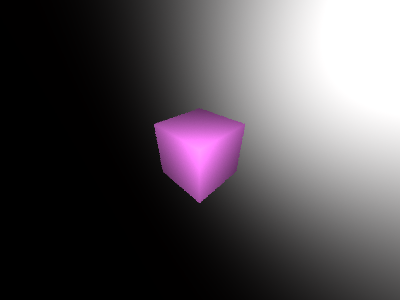
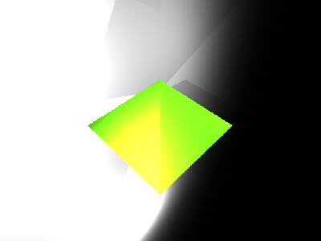
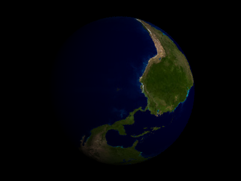
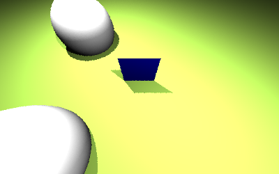
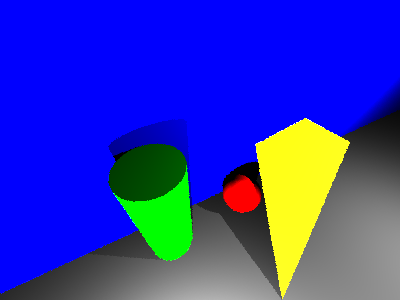
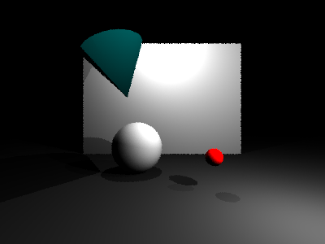

# 1. What is miniRT?

This project is the implementation of simple Ray Tracer to render shapes from the given scene file.

# 2. How to compile the implemented program?

There is a `Makefile` which provides the common rules (all, clean, fclean, re) including bonus rule in the folder. After compiling all of the source codes, the program file will be generated.
* For the Mandatory
> make all
* For the Bonus
> make bonus

# 3. How to execute the implemented program?
The name of this program is `miniRT` and it takes the name of the scene file which ends with `.rt` as a string argument. To execute the program, type the command listed below.
> ./miniRT \<scene-name>

# 4. How to save the Scene as a BMP file?
miniRT supports to save the scene as a BMP file. It is necessary to specity `--save` option after the execution command.
> ./miniRT \<scene-name> --save

# 5. Which are the allowed external functions?

1. `open` on \<fcntl.h>
2. `close` on \<fcntl.h>
3. `read` on \<unistd.h>
4. `write` on \<unistd.h>
5. `printf` on \<stdio.h>
6. `perror` on \<stdio.h>
7. `strerror` on \<string.h>
8. `malloc` on \<stdlib.h>
9. `free` on \<stdlib.h>
10. `exit` on \<stdlib.h>

# 5. Possible Shapes

| Color Filters | Objects | Materials | Number of Threads |
| - | - | - | - |
| `R`   `G`   `B`   `Sepia` | `Sphere`   `Plane`   `Square`   `Cylinder`   `Triangle`   `Cone` | `Lambertian`   `Metal`   `Dielectrics` | `Number of Images + 8` |

# 6. Features

1. Internally this program use the MiniLibX library. There are 2 ways to use the library. One is static library and another is dynamic library. This is using the dynamic library, so it is necessary to specify the Dynamic Library Path. This process is on the `Makefile` by using `install_name_tool` command.

2. MiniLibX is using the AppKit and OpenGL to render the pixels on the Screen. To make the executable file, AppKit and OpenGL is used as a framework option on the Compile Command.

3. It is allowed to accept Key Hook Events and Mouse Hook Events. Press ESC on the Keyboard to terminate the program. Also, it is okay to press the cross button on the Top-Left Corner of the Screen. To control the cameras in the scene, actions of the Keyboard and Mouse is acceptable. For the detail, execute the program then the guide panel will be shown.

4. Images are generated by the number of cameras specified in the scene file, and Multi-Threading occurs during this process. Switching image does not request any calculation for the pixels to show, since computing all of the pixels for each image is performed at the initial execution of the program. When some change occurs through Keyboard and Mouse on a Image, pixel calculation is performed again only on the image. It can be lead to performance improvement.

5. There are several Hidden Modes like `Sine Waves`, `Rainbow Effect`, `Checker Effect`, `Images Texturing` on the `Sphere` Objects.

6. Red, Green, Blue, Sepia color filters are available for each image.

7. If the strings given in the scene file cannot be interpreted, `miniRT` will be terminated abnormally by displaying the proper error phrase.

8. The color of an object can only be seen by the given lights. If the object is farther away from the lights, the object looks darker since the brightness of the lights decrease. (Decrease of the brightness follows the .)

9. Anti-Aliasing is available.

10. Sampling count for the Anti-Aliasing, the number of threads for calculating pixels, size of the screen, etc are controlled by Macro Constatns on the Header File.

# 7. Demo

    
    
    

    
    
    

