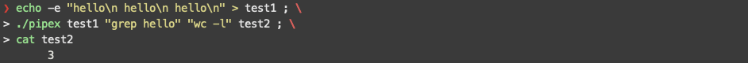
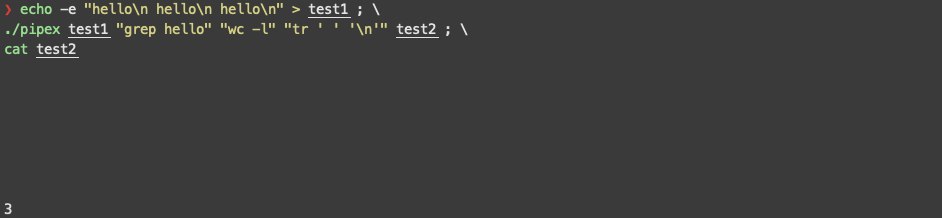
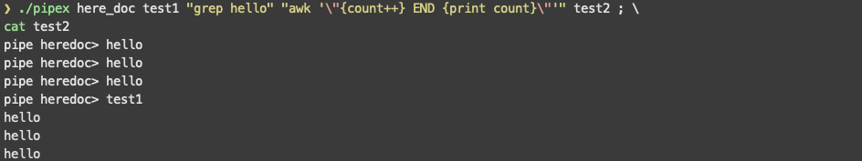
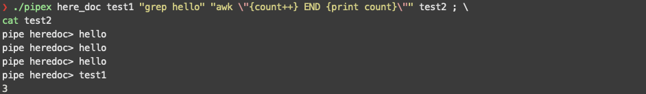

# 0. Subject & Guide Link

* [Subject](https://github.com/bigpel66/42-cursus/blob/main/circle-02/circle02%20-%20pipex.pdf)
* [Guide Link](https://bigpel66.oopy.io/library/42/inner-circle/8)

# 1. Waht is pipex?

This project is the implementation of some part of the shell which can execute the piped commands and redirect to the file (STDIN, STDOUT).

# 2. How to compile the implemented program?

There is a `Makefile` which provides the common rules (all, clean, fclean, re) including bonus rule in the folder. After compiling all of the source codes, the program file will be generated. The common rules for the Mandatory only can process sole pipe and the form of the arguments to execute has to be `infile cmd1 cmd2 outfile`. The bonus rule for the Bonus can process the multiple pipe and the form of the arguments to execute will be `infile cmd1 cmd2 cmd3 ... outfile`.
* For the Mandatory
> make all
* For the Bonus
> make bonus

# 3. How to execute the implemented program?
The name of this program is `pipex` and it takes the infile, outfile to redirect the STDIN (<), STDOUT (>) and 2 commands to pipe. To execute the mandatory program, type the command listed below. The arguments will be processed as same as `< infile cmd1 | cmd2 > outfile` on the shell.
> ./pipex \<infile> \<cmd1> \<cmd2> \<outfile>

To execute the bonus program, the project needs to be compiled with the bonus rule before. Then, it takes the infile, outfile to redirect STDIN (<), STDOUT (>) like previous one, but multiple commands can be accepted. The arguments will be process as same as `< infile cmd1 | cmd2 | cmd3 ... > outfile` on the shell.
> ./pipex \<infile> \<cmd1> \<cmd2> \<cmd3> ... \<outfile>

Only for the bonus program, it supports not only the single angle bracket for the STDOUT (>), but also the double angle bracket for the STDOUT (>>). The single angle bracket used to overwite the entire file, but the double angle bracket used to append after the file. This can be done by submitting the arguments which index is `1` and has the `here_doc`. In this case, the double bracket for the STDIN (<<) will be supported instead of the single bracket for the STDIN (<). That means, `infile` will be replaced to the `limiter` and the lines that a user typed will be written on the STDIN until typing the `limiter`. When the `limiter` typed, the first commands will be executed by taking the all of the lines on the STDIN (except the `limiter`).
> ./pipex here_doc \<limiter> \<cmd1> \<cmd2> \<cmd3> ... \<outfile>

# 4. Which are the allowed external functions?

1. `access` on \<unistd.h>
2. `unlink` on \<unistd.h>
3. `close` on \<unistd.h>
4. `read` on \<unistd.h>
5. `write` on \<unistd.h>
6. `pipe` on \<unistd.h>
7. `dup` on \<unistd.h>
8. `dup2` on \<unistd.h>
9. `execve` on \<unistd.h>
10 `fork` on \<unistd.h>
11. `malloc` on \<stdlib.h>
12. `free` on \<stdlib.h>
13. `exit` on \<stdlib.h>
14. `waitpid` on \<sys/wait.h>
15. `wait` on \<sys/wait.h>
16. `perror` on \<stdio.h>
17. `strerror` on \<string.h>
18. `open` on \<fcntl.h>

# 5. Features

1. As mentioned above, pipex can handle a piped commands. While handling them, the STDIN (<) and STDOUT (>) redirection has been used.

2. When using the part of the bonus, pipex can handle the multiple piped commands.

3. On the bonus, the STDIN (<<), STDOUT (>>) redirection can be handled by using the `here_doc` as a argument of index `1`. Then, the user input will be sent to the first command, and the final output will be appended to the `outfile`. The user input will be taken until the limiter is shown.

4. All of these commands will be executed on their own process which is replacing the forked process. This is the property of the exec function. Thus, handling the exception is important and catch them on the parent process appropriately.

5. While processing the piped commands, the STDIN and STDOUT will be duplicated to the pipe. To make the proper result, File Descriptors like STDIN and STDOUT on the parent process should not be corrupted. Thus, duplicating is always done on the child process.

6. Multiple piping is conducted by forking child process at each iterating time on the loop. Parent process will control the pipe File Descriptors and wait for the result of executed commands on the child process. About controlling the pipe File Descriptor on the parent process, it is recommended to close unused File Descriptors for the child process of the next loop not to have the unused writing File Desciptors.

7. To find the proper commands which has to be executed on the child process, the environment variable $PATH is used. Thus, `main` function takes the third arugment `char **envp`. The procedure to execute the command by execve function is as similar as execvp function due to using $PATH, but there is a difference that execve function can sure unchanged $PATH while running the pipex. Though using $PATH is reluctant because it can cause the `$PATH injection attack`, $PATH is parsed only once on the entrypoint of the pipex to call the execve. If the $PATH changed while running the pipex, it doesn't matter on this program because it does not use the execvp function.

8. Commands will be parsed into chunk. If there's no quote, only whitespace will be the delimiter. If there's quote, quote will be the delimiter. Multiple quotes is avilable while using commands.

# 6. Demo

    
    
    
    

