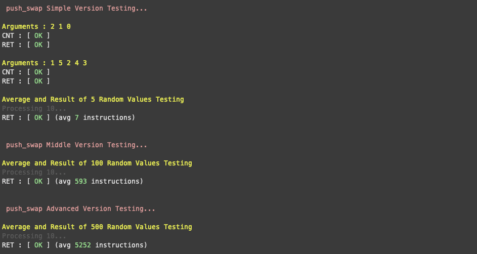
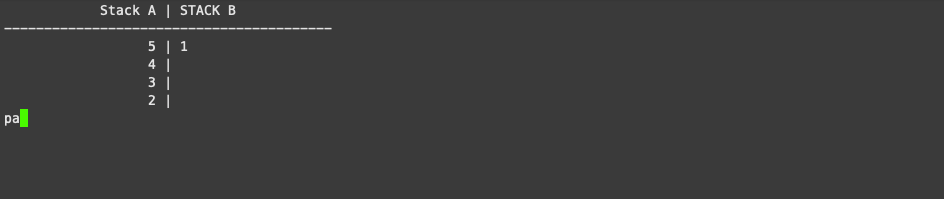
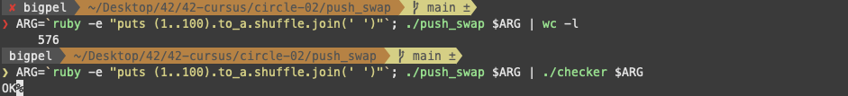

# 0. Guide Link

https://bigpel66.oopy.io/library/42/inner-circle/7

# 1. What is push_swap?

This project is the implementation of Quick Sort program which is made of Stack Sort algorithm. Only 2 stacks and 11 rules enabled to make elements ascending orders.

# 2. How to compile the implemented program?

There is a `Makefile` which provides the common rules (all, clean, fclean, re) including bonus rule in the folder. After compiling all of the source codes, the program file will be generated.
* For the Mandatory
> make all
* For the Bonus
> make bonus

Also, this project does not use given `checker` source code on the intra. `checker` is already implemented with the `push_swap`, so compiling with the mandatory rule will produce `checker` and `push_swap`. There are test scripts which can be run on the shell. These can grade the program while taking a peer-evaluation. To take a test, type the commande listed below.
> make test

# 3. What kind of tests are included?
1. checker Error
To validate `checker` that returns the "Error" properly when it is on the exception.

2. checker False
To validate `checker` that returns the "KO" properly when the result after the given instruction is not sorted.

3. checker True
To validate `checker` that returns the "OK" properly when the result after the given instruction is sorted.

4. push_swap Identity
To validate `push_swap` that does not spend any instructions to sort when it gets the already sorted arguments.

5. push_swap Simple Version
To validate `push_swap` that complies with the instruction guideline. Instructions should be returned under 3 when it gets the 3 numeric arguments, under 12 when it gets the 5 numeric arguments.

6. push_swap Middle Version
Check the average instructions when it gets the 100 numeric arguments with the status of the sorting result. They recommened to be under 700 to get a full grade.

7. push_swap Advanced Version
Check the average instructions when it gets the 500 numeric arguments with the status of the sorting result. They recommened to be under 5500 to get a full grade.

# 4. How to execute the implemented program?
`push_swap` will generate the instructions to make the elements ascending orders, so this program takes the several numeric arguments which has to be ordered properly.
> ./push_swap \<numeric-arguments>

`checker` will grade the given instructions to sort the numeric arguments, so this program takes the several numeric arguments which has been used on `push_swap`. Instead of giving the instructions as `string`, these will be given with the `standard input`. Instructions can be transmitted by the `pipe`, or only manual input should be followed. When the instructions sent by manual way, `CTRL + D` is the signal of `End of Transmission`.
> ./checker \<numeric-arguments>
<p/>

> ./push_swap \<numeric_arguments> | ./checker \<numeric-arguments>
<p/>

> ARG=\<numeric-arguments> ; ./push_swap $ARG | ./checker $ARG

`checker` is able to show the status of 2 Stacks by the visualization option. `checker` supports the `--debug` option, this should be placed only at the end of the phrase which executes `checker`.
> ./checker \<numeric-arguments> --debug
<p/>

> ./push_swap \<numeric_arguments> | ./checker \<numeric-arguments> --debug
<p/>

> ARG=\<numeric-arguments> ; ./push_swap $ARG | ./checker $ARG --debug

# 5. Which are the allowed external functions?

1. `write` on \<unistd.h>
2. `read` on \<unistd.h>
3. `malloc` on \<stdlib.h>
4. `free` on \<stdlib.h>
5. `exit` on \<stdlib.h>

# 6. Features

1. No duplicated arguments, non-numeric arguments are allowed. Including failure of dynamic memory allocation, `push_swap` and `checker` will return "Error" on these situation.

2. Though implemented sorting algorithm is `n * n` on the Big-O notation, this is not fully `n * n`. Like `Quick Sort` this sorting alorithm ensures the average performance as `n * log n`. To be ensured the average performance, checking duplication should not be `n * n`. Thus not to check the duplication on the brute force, both program use the `Red-Black Tree` which ensures the `n * log n`.

3. Only 11 instructions are allowed.
<p/>

		pb : Pushing top of the 1 element from A to B
<p/>

		pa : Pushing top of the 1 element from B to A
<p/>

		ra : Rotating A with ccw
<p/>

		rb : Rotating B with ccw
<p/>

		rr : Rotating both with ccw
<p/>

		rra : Rotating A with cw
<p/>

		rrb : Rotating B with cw
<p/>

		rrr : Rotating both with cw
<p/>


		sa : Swapping top of the 2 elements on A
<p/>

		sb : Swapping top of the 2 elements on B
<p/>

		ss : Swapping top of the 2 elements on both
<p/>


4. Not to mess up the instructions, `push_swap` is orienting the lowest call of push and swap instructions.

5. To see the result of the insturctions while running `checker`, execute the `checker` with the `--debug` option.

# 7. What is the key algorithm to solve the project?

1. Find the longest sorted interval and record the start index and finish index.
2. Place the interval to the bottom of A Stack through rotations instruction which will be ra or rra by (finsh index + 1) % length of A Stack.
3. Push all of the elements which are placed on the start index of the interval to the B Stack.
4. For every element of the B Stack, Find the appropriate index and calculate the total instruction to be placed on A Stack.
5. Update the predicate which has the smaller instructions.
6. After searching all of the elements of B Stack, there will be a predicate which has the minimum instructions. Execute the rotation instructions from the predicate.
7. Iterate until B Stack is empty.

This is just psuedo-code which is written by Korean.

```c
func do_before_sort()
{
	// 가장 길게 정렬되어 있는 구간을 찾는다.
	find_longest_sort()
	// 찾은 위치를 토대로 해당 구간이 A Stack 가장 아래에 위치할 수 있도록 rotation을 수행한다.
	// rotation은 구간의 끝 index + 1이 A Stack 절반보다 큰 지 작은 지 판별하여 cw, ccw를 수행한다.
	stack_correction()
	// Stack Correction 이후에 가장 길게 정렬되어 있는 구간의 index가 바뀌어 있을 수도 있다.
	// 따라서 구간 검색을 다시 한 번 해주어 a_to_b 호출 시 이미 정렬되어 있는 값이 B Stack으로 가지 않도록 한다.
	find_longest_sort()
}

func a_to_b()
{
	while A Stack의 모든 lst에 대해서
		if current lst index < 정렬되어 있는 구간의 시작 index
			do pb
}

func b_to_a()
{
	do 임시 predicate 초기화
	while B Stack의 lst가 존재하지 않을 때까지
	{
		do 최소 predicate 초기화
		while B Stack의 모든 lst에 대해서
		{
			do current lst에 대해 소요되는 명령어 횟수를 임시 predicate에 기록
			if 최소 predicate > 임시 predicate
				최소 predicate := 임시 predicate
		}
		do predicate에 기록된 횟수만큼 A Stack과 B Stack을 rotation
		do pa
	}
}

func sort_3()
{
	// do_before_sort에서 이미 최소 2개는 정렬이 되어 있다.
	// 따라서 do_before_sort 과정 이후에도 정렬이 안 되어 있는 경우는 총 2가지다.

	// 2 1 3 -> sa 수행
	if current lst val > next lst val && current lst val < next next lst val
		do sa
	// 3 1 2 -> ra 수행
	else if current lst val > next next val
		do ra
}

func sort_5()
{
	// A Stack의 길이가 4인 경우에는 do_before_sort에서 찾은 구간의 크기가 2, 3이 된다.
	// A Stack의 길이가 5인 경우에는 do_before sort에서 찾은 구간의 크기가 2, 3, 4가 된다.
	// 3개짜리 정렬 로직이 있으므로 현재 함수에서 최대한 3개짜리 정렬 로직을 활용한다.

	// 구간의 크기가 2인 경우에는 A Stack에 인자를 3개가 되도록 만들고 이를 정렬한다.
	if 정렬된 구간의 크기 < 3
	{
		A Stack에 3개만 남기고 B Stack으로 push
		sort_3()
	}
	// 구간의 크기가 3이상인 경우에는 구간에 해당하지 않는 값을 B Stack으로 넘기는 함수를 호출한다.
	else
		a_to_b()
	// 이 후에는 A Stack에는 최소 3개 이상이 정렬되어 있는 상태고 나머지는 B Stack에 위치한다.
	// 따라서 b_to_a를 호출하여 B Stack의 인자들이 A Stack에 제 위치에 있도록 만들어준다.
	b_to_a()
	// B Stack의 인자들을 A Stack으로 옮긴 후에는 최소 인자가 가장 앞에 와있지 않을 수 있다.
	// 따라서 A Stack에서 가장 작은 값을 찾아 Stack Correction을 수행한다.
	stack_correction()
}

func sort_others()
{
	a_to_b()
	b_to_a()
	stack_correction()
}

func yield()
{
	// do_before_sort에서 가장 길게 정렬된 구간을 찾는다.
	// 찾은 구간으로 Stack Correction을 거치므로 최소 2개의 인자는 정렬이 되어 있게 된다.
	do_before_sort()
	if A Stack의 길이 < 2
		return
	else if A Stack의 길이 == 3
		sort_3()
	else if A Stack의 길이 <= 5
		sort_5()
	else
		sort_others()
}
```

# 8. Demo

<div style="display:flex" align="center">
    
    
    
</div>
