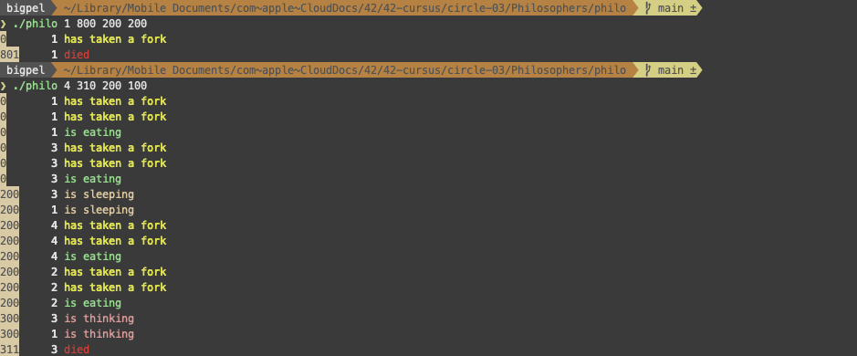
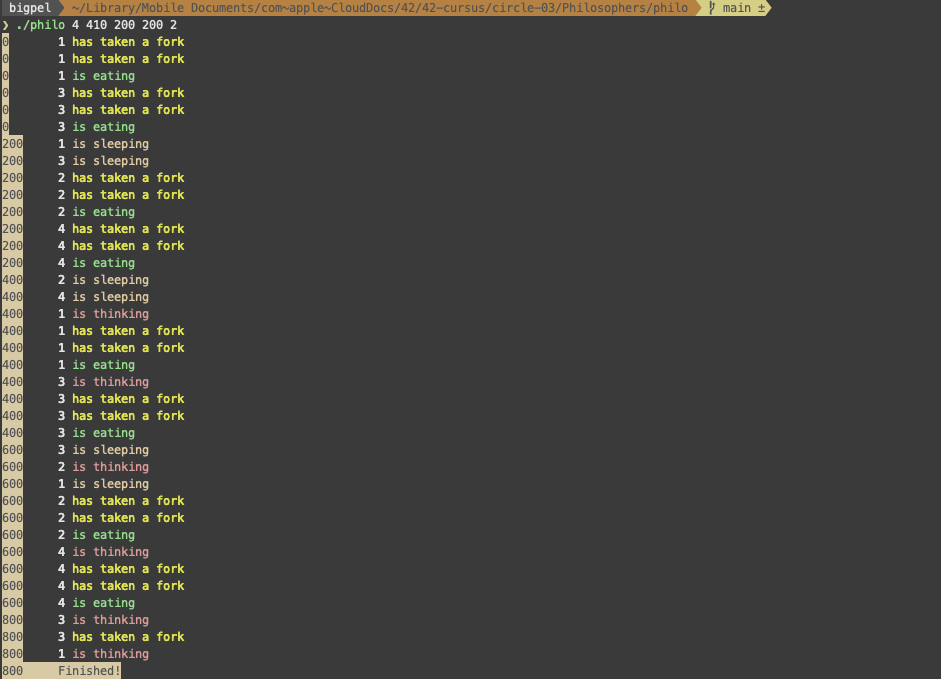
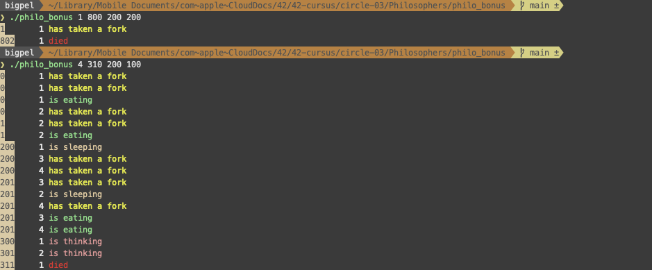
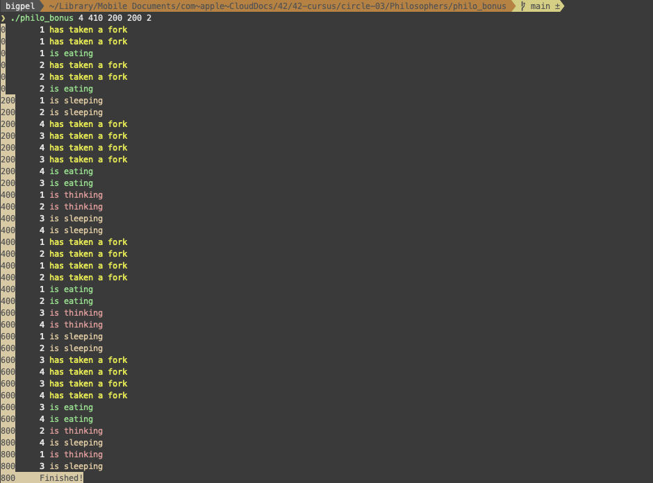

# 0. Subject & Guide Link

* [Subject][https://github.com/bigpel66/42-cursus/blob/main/circle-03/circle03%20-%20Philosophers.pdf]
* [Guide Link](https://bigpel66.oopy.io/library/42/inner-circle/9)

# 1. What is Philosophers?

# 2. How to compile the implemented program?

# 3. How to execute the implemented program?

# 4. Which are the allowed external functions?

1.
2.
3.
4.

# 5. Features

# 6. Demo

    
    
    
    

