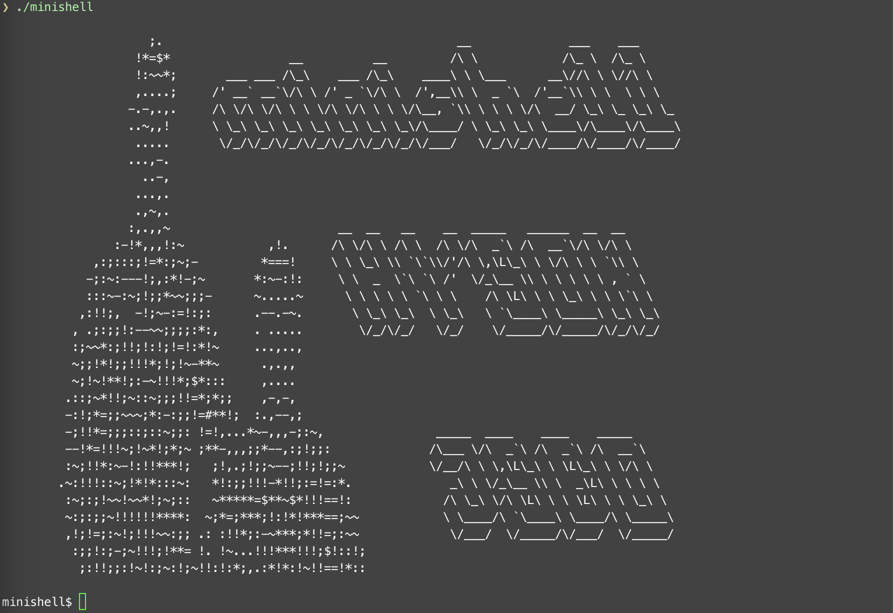
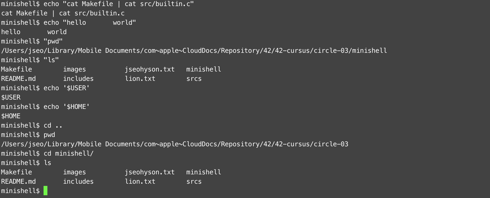
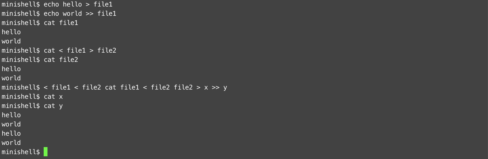
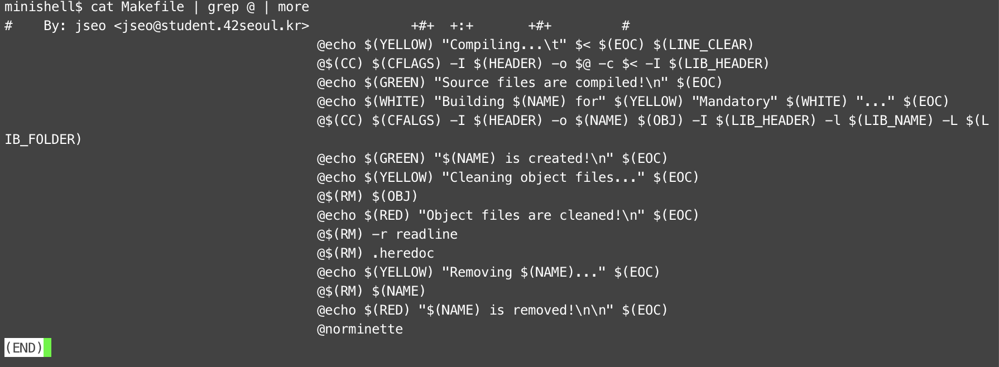

# 0. Subject & Guide Link

* [Subject](https://github.com/bigpel66/42-cursus/blob/main/circle-03/circle03%20-%20minishell.pdf)
* [Guide Link](https://bigpel66.oopy.io/library/42/inner-circle/10)

# 1. What is minishell?

This program is the implementation of shell program referenced by Bash.

# 2. How to compile the implemented program?

To compile the shell, readline from GNU dynamic library is necessary
> brew install readline@8.1

Also, LIBRARY_HEADER and LIBRARY_FOLDER variable in the `Makefile` should be revised to the user's own path.

Given `Makefile` which provides the common rules (all, clean, fclean, re). After compiling all of the source codes, the program file will be generated.
* Only for the Mandatory (should enter the command in the appropriate path)
> make all

# 3. How to execute the implemented program?

The arguments of binary file just will be stored in # and * environment variables.

Prompt of this shell is accordance with name of the binary file on the initial execution.
> ./minishell

# 4. Which are the allowed external functions?

* For the Mandatory
1. `open` on \<unistd.h>
2. `close` on \<unistd.h>
3. `read` on \<unistd.h>
4. `write` on \<unistd.h>
5. `unlink` on \<unistd.h>
6. `fork` on \<unistd.h>
7. `dup` on \<unistd.h>
8. `dup2` on \<unistd.h>
9. `pipe` on \<unistd.h>
10. `execve` on \<unistd.h>
11. `getcwd` on \<unistd.h>
12. `chdir` on \<unistd,h>
13. `isatty` on \<unistd.h>
14. `ttyname` on \<unistd.h>
15. `ttyslot` on \<unistd.h>
16. `errno` on \<errno.h>
17. `printf` on \<stdio.h>
18. `strerror` on \<string.h>
19. `malloc` on \<stdlib.h>
20. `free` on \<stdlib.h>
21. `getenv` on \<stdlib.h>
22. `exit` on \<stdlib.h>
23. `kill` on \<signal.h>
24. `signal` on \<signal.h>
25. `opendir` on \<dirent.h>
26. `closedir` on \<dirent.h>
27. `readdir` on \<dirent.h>
28. `tcgetattr` on \<term.h>
29. `tcsetattr` on \<term.h>
30. `tgetent` on \<term.h>
31. `tgetflag` on \<term.h>
32. `tgetnum` on \<term.h>
33. `tgetstr` on \<term.h>
34. `tgoto` on \<term.h>
35. `tputs` on \<term.h>
36. `ioctl` on \<sys/ioctl.h>
37. `wait3` on \<sys/wait.h>
38. `wait4` on \<sys/wait.h>
39. `wait` on \<sys/wait.h>
40. `waitpid` on \<sys/wait.h>
41. `stat` on \<sys/stat.h>
42. `lstat` on \<sys/stat.h>
43. `fstat` on \<sys/stat.h>
44. `readline` on \<readline/readline.h>
45. `rl_on_new_line` on \<readline/readline.h>
46. `rl_replace_line` on \<readline/readline.h>
47. `rl_redisplay` on \<readline/readline.h>
48. `add_history` on \<readlien/history.h>

# 5. Features

1. Readline library is not the default one, must install GNU readline.
2. Overall flows of the shell is `Expand the environment variables from user input -> Tokenize the expanded input into the chunks -> Build AS (Abstract Syntax) Tree -> Execute`.
3. AS Tree has been used to build the execution plan.
4. RB Tree has been used to map the key and value from environment variables. (Pretended that searching specific node has more frequency than searching total.)
5. Multi-Piping, Multi-Redirection is ok.
6. If Multi-Pipings and Multi-Redirections are mixed, only pipex form is allowed.
7. Heredoc cannot be duplicated on the input.
8. Initial prompt is accordance with name of the binary file.
9. $*, $#, $?, $_ is ok.
10. If quotes, redirections, pipes of command input are not formed well, syntax error occurs. (Multi-Lininig is not supported.)
11. Every special character like \, ; are not supported except '\\' + ' ' case for the file name.
12. Ctrl + C , Ctrl + D , Ctrl + \ is implemented as same as Bash.
13. Global Variables are not used on this project.
14. Readline library has been used due to the support of vim-like editing.
15. History management is based on the `add_histroy` function. Thus, arrow keys on the keyboard can be used.
16. Several builtin commands have been implemented. (`echo`, `cd`, `pwd`, `export`, `unset`, `env`, `exit`)

# 6. Things to be Revised
1. Ctrl + C, Ctrl + \ does not update the Exit Code on the Empty Prompt. (Though updates on the execution is fine.)
> This can be solved by using a Global Variable.
2. To apply &&, ||, * on the bonus part, some policies of AS Tree must be added and priorities should be subdivided.
3. Though `Expand -> Tokenize -> AS Tree` flows are working well on the Mandatory, `Tokenize -> AS Tree -> Expand` is more appropriate on the Bonus or Real Shell.

# 7. Demo

<div style="display:flex" align="center">
    
    
    
    
</div>

# 8. Ascii Art before Current One

```
@@@@@@@@@@@@@@@@@@@@@@@@@@@@@@@@@@@@@@@@@@@@@@@@@@@@@@@@@@@@@@@@@@@@@@@@@@@@@@@@@@@@@@@@@@@@@@@@@@@@
@@@@@@@@@@@@@@@@@@@@@@@@@@@@@@@@@@@@@@@@@@@@@@@@@@@@@@@@@@@@@@@@@@@@@@@@@@@@@@@@@@@@@@@@@@@@@@@@@@@@
@@@@ ______@@_______@@@@@@@@@@@@@@@@@@@@@@@@@@@@@@@@@@@@@@@@@@@@@@@@@@@@@@@@@@@@@@@@@@@@@@@@@@@@@@@@
@@@@|      \/       \@@@@@@@@@@@@@@@@@@@@@@@@@@@@@@@@@@@@@@@@@@@@@@@@@@@@@@@@@@@@@@@@@@@@@@@@@@@@@@@
@@@/          /\     \@@@@@@@@@@@@@@@@@@@@@@@@@@@@@@@@@@@@@@@@@@@@@@@@@@@@@@@@@@@@@@@@@@@@@@@@@@@@@@
@ /     /\   / /\     |@@@@@@@@@@@@@@@@@@@@@@@@@@@@@@@@@@@@@@@@@@@@@@@@@@@@@@@@@@@@@@@@@@@@@@@@@@@@@
@/     /\ \_/ /@/    /|@@@@@@@@@@@@@@@@@@@@@@@@@@@@@@@@@@@@@@@@@@@@@@@@@@@@@@@@@@@@@@@@@@@@@@@@@@@@@
|     |@@\|_|/@/    / |@@@@@@@@@@@@@@@@@@@@@@@@@@@@@@@@@@@@@@@@@@@@@@@@@@@@@@@@@@@@@@@@@@@@@@@@@@@@@
|     |@@@@@@@|    |  |@@@@@@@@@@@@@@@@@@@@@@@@@@@@@@@@@@@@@@@@@@@@@@@@@@@@@@@@@@@@@@@@@@@@@@@@@@@@@
|\____\ @@@@@@|____|  /@@@@@@@@@@@@@@@@@@@@@@@@@@@@@@@@@@@@@@@@@@@@@@@@@@@@@@@@@@@@@@@@@@@@@@@@@@@@@
| |    |@@@@@@|    | /@@@@@@@@@@@@@@@@@@@@@@@@@@@@@@@@@@@@@@@@@@@@@@@@@@@@@@@@@@@@@@@@@@@@@@@@@@@@@@
@\|____|@@@@@@|____|/@@@@@@@@@@@@@@@@@@@@@@@@@@@@@@@@@@@@@@@@@@@@@@@@@@@@@@@@@@@@@@@@@@@@@@@@@@@@@@@
@@@@\(@@@@@@@@@@)/@@@@@@@@@@@@@@@@@@@@@@@@@@@@@@@@@@@@@@@@@@@@@@@@@@@@@@@@@@@@@@@@@@@@@@@@@@@@@@@@@@
@@@@@'@@@@@@@@@@'@@@@@@@@@@@@@@@@@@@@@@@@@@@@@@@@@@@@@@@@@@@@@@@@@@@@@@@@@@@@@@@@@@@@@@@@@@@@@@@@@@@
@@@@@@@@ ____ @@@@@@@@@@@@@@@@@@@@@@@@@@@@@@@@@@@@@@@@@@@~@@@@@@@#@@ --@@@@@@@@@@@@@-;;-@@@@@@@@@@@@
@@@@@@@@|    |@@@@@@@@@@@@@@@@@@@@@@@@@@@@@@@@@@@@@@@@@@!@@:..!@@@@@@@@@@@@@#~@@@@*@@@@@@#@@@@@@@@@@
@@@@@@@@|    |@@@@@@@@@@@@@@@@@@@@@@@@@@@@@@@@@@@@@@@@@-@@.#@@@@@@*~-,,-:=@@@@@@;@@@~,.-@@@:@@@@@@@@
@@@@@@@@|    |@@@@@@@@@@@@@@@@@@@@@@@@@@@@@@@@@@@@@@@@@@@@@@@!...............,=@@@@,.....,@@;@@@@@@@
@@@@@@@@|    |@@@@@@@@@@@@@@@@@@@@@@@@@@@@@@@@@@@@@@@@~@@@*.....................,@@@@......@@@@@@@@@
@@@@@@@@|    |@@@@@@@@@@@@@@@@@@@@@@@@@@@@@@@@@@@@@@@@@@:..........................#@@!.....@#@@@@@@
@@@@@@@@|    |@@@@@@@@@@@@@@@@@@@@@@@@@@@@@@@@@@@@@-@@$.............................,@@@....@@@@@@@@
@@@@@@@@|____|@@@@@@@@@@@@@@@@@@@@@@@@@@@@@@@@@@@@;@@-................................!@@,..@@@@@@@@
@@@@@@@@|    |@@@@@@@@@@@@@@@@@@@@@@@@@@@@@@@@@@@*@@.......,..........,,,,,,,,,,.......,@@-.@@@@@@@@
@@@@@@@@|____|@@@@@@@@@@@@@@@@@@@@@@@@@@@@@@@@@@!@@@@@@@@@$..........*@@@@@@@@@@#........@@.@@@@@@@@
@@@@@@@@@@\(@@@@@@@@@@@@@@@@@@@@@@@@@@@@@@@@@@@@@@@@@@@@@@!..........~@@@@@@@@@@;.........@@@!@@@@@@
@@@@@@@@@@@'@@@@@@@@@@@@@@@@@@@@@@@@@@@@@@@@@@@@@.........................................,@@@@@@@@@
@ _____@@@______@@@@@@@@@@@@@@@@@@@@@@@@@@@@@@!@*.....-,..................,!,................@@@@@@@
@|\    \@|\     \@@@@@@@@@@@@@@@@@@@@@@@@@@@@@@@.....#@@:.................@@@,................@@@@@@
@@\\    \|@\     \@@@@@@@@@@@@@@@@@@@@@@@@@@@!@~.....@@@@.................@@@~................=@-@@@
@@@\|    \@@\     |@@@@@@@@@@@@@@@@@@@@@@@@@@@@......$@@:.................@@@..................@@@@@
@@@@|     \@@|    |@@@@@@@@@@@@@@@@@@@@@@@@@;@;.......,....................,...................#@@@@
@@@@|      \@|    |@@@@@@@@@@@@@@@@@@@@@@@@@@@..................................................@;@@
@@@@|    |\ \|    |@@@@@@@@@@@@@@@@@@@@@@@@@@@............--:@@@:...............................@@@@
@@@@|____||\_____/|@@@@@@@@@@@@@@@@@@@@@@@@@@;........,.@@@@@@@@@@@@;...........................@@@@
@@@@|    |/@\|   ||@@@@@@@@@@@@@@@@@@@@@@@@=@.........,@@*. $@@@@==@@@..........................:@ @
@@@@|____|@@@|___|/@@@@@@@@@@@@@@@@@@@@@@@@#@.........@@     @@@    ;@!.........................,@;@
@@@@@@\(@@@@@@@)/@@@@@@@@@@@@@@@@@@@@@@@@@@@@.........@=             @@..........................@=@
@@@@@@@'@@@@@@@'@@@@@@@@@@@@@@@@@@@@@@@@@@@@@.........@:             *@..........................@@@
@@@@@@@@ ____@@@@@@@@@@@@@@@@@@@@@@@@@@@@@@@@.........@#     ;@      #@..........................@@@
@@@@@@@@|    |@@@@@@@@@@@@@@@@@@@@@@@@@@@@@@@.........$@,   .@@,     @@..........................@@@
@@@@@@@@|    |@@@@@@@@@@@@@@@@@@@@@@@@@@@@@@@..........@@@#@@@@@#. ~@@,..........................@@@
@@@@@@@@|    |@@@@@@@@@@@@@@@@@@@@@@@@@@@@@@@...........=@@@=..#@@@@@-...........................@@@
@@@@@@@@|    |@@@@@@@@@@@@@@@@@@@@@@@@@@@@@@@....................,-,.............................@@@
@@@@@@@@|    |@@@@@@@@@@@@@@@@@@@@@@@@@@@@@@@....................................................@#@
@@@@@@@@|    |@@@@@@@@@@@@@@@@@@@@@@@@@@@@@#@....................................................@!@
@@@@@@@@|____|@@@@@@@@@@@@@@@@@@@@@@@@@@@@@@@...................................................-@-@
@@@@@@@@|    |@@@@@@@@@@@@@@@@@@@@@@@@@@@@@-@~..................................................=@@@
@@@@@@@@|____|@@@@@@@@@@@@@@@@@@@@@@@@@@@@@@@@..................................................@@@@
@@@@@@@@@@\(@@@@@@@@@@@@@@@@@@@@@@@@@@@@@@@@@@..................................................@=@@
@@@@@@@@@@@@@@@@@@@@@@@@@@@@@@@@@@@@@@@@@@@@!@~................................................*@:@@
@@@@@@@@@@@@______@@@@@@@@@@@@@@@@@@@@@@@@@@@@@................................................@@@@@
@@@@@@@@___|\     \@@@@@@@@@@@@@@@@@@@@@@@@@@#@,..............................................:@:@@@
@@@@@@@|    |\     \@@@@@@@@@@@@@@@@@@@@@@@@@@@@............................................. @@@@@@
@@@@@@@|    |/____/|@@@@@@@@@@@@@@@@@@@@@@@@@@@@*............................................$@-@@@@
@@@@___|    \|   | |@@@@@@@@@@@@@@@@@@@@@@@@@@@@@,..........................................-@@@@@@@
@@@|    \    \___|/@@@@@@@@@@@@@@@@@@@@@@@@@@@@@@@.........................................,@@@@@@@@
@@@|    |\     \@@@@@@@@@@@@@@@@@@@@@@@@@@@@@@@@ @@........................................@@-@@@@@@
@@@|\ ___\|_____|@@@@@@@@@@@@@@@@@@@@@@@@@@@@@@@@!@@,....................................,@@-@@@@@@@
@@@| |    |     |@@@@@@@@@@@@@@@@@@@@@@@@@@@@@@@@@;@@~..................................~@@-@@@@@@@@
@@@@\|____|_____|@@@@@@@@@@@@@@@@@@@@@@@@@@@@@@@@@@@@@@...............................,@@@ @@@@@@@@@
@@@@@@@\(@@@@)/@@@@@@@@@@@@@@@@@@@@@@@@@@@@@@@@@@@@@@=@@*............................#@@$@@@@@@@@@@@
@@@@@@@@'@@@@'@@@@@@@@@@@@@@@@@@@@@@@@@@@@@@@@@@@@@@@@;@@@$..,.....................@@@@@@@@@@@@@@@@@
@@@@@____@@@____@@@@@@@@@@@@@@@@@@@@@@@@@@@@@@@@@@ @@@@@;@@@@;,................,=@@@@:@@@@@@@@@@@@@@
@@@@|    |@|    |@@@@@@@@@@@@@@@@@@@@@@@@@@@@@@@@@@@@@@@@@.$@@@@@=:,......-;$@@@@@!.@@@@@@@@@@@@@@@@
@@@@|    |@|    |@@@@@@@@@@@@@@@@@@@@@@@@@@@@@@@@@@@@@@@@,...,!@@@@@@@@@@@@@@@@:....,@@@@@@@@@@@@@@@
@@@@|    |@|    |@@@@@@@@@@@@@@@@@@@@@@@@@@@@@@@@@@@@@,@#.........,,~;!!:~,..........#@,@@@@@@@@@@@@
@@@@|    .-.    |@@@@@@@@@@@@@@@@@@@@@@@@@@@@@@@@@@@@@@@..............................@@@@@@@@@@@@@@
@@@@|    |@|    |@@@@@@@@@@@@@@@@@@@@@@@@@@@@@@@@@@@@@@$@@............................$@;@@@@@@@@@@@
@@@@|    |@|    |@@@@@@@@@@@@@@@@@@@@@@@@@@@@@@@@@@@@*@,@@,.. ..,.. ....,. ...........,@$@@@@@@@@@@@
@@@@|____|@|____|@@@@@@@@@@@@@@@@@@@@@@@@@@@@@@@@@@@@@@.@!..   ..    ....   .,.........@@@@@@@@@@@@@
@@@@|    |@|    |@@@@@@@@@@@@@@@@@@@@@@@@@@@@@@@@@@@@@$-@,.           .     ...........*@@@@@@@@@@@@
@@@@|____|@|____|@@@@@@@@@@@@@@@@@@@@@@@@@@@@@@@@@@@,@~=@..                  ..........-@~@@@@@@@@@@
@@@@@@\(@@@@@)/@@@@@@@@@@@@@@@@@@@@@@@@@@@@@@@@@@@@@!@.#@.                   ...~@......@!@@@@@@@@@@
@@@@@@@'@@@@@'@@@@@@@@@@@@@@@@@@@@@@@@@@@@@@@@@@@@@@$@.@@.                    ..;@......@*@@@@@@@@@@
@@@@@@@@@______@@@@@@@@@@@@@@@@@@@@@@@@@@@@@@@@@@@@@@@.@@.                    ..~@......@*@@@@@@@@@@
@@@@@___|\     \@@@@@@@@@@@@@@@@@@@@@@@@@@@@@@@@@@@@@@.@@.                    ..-@.....,@!@@@@@@@@@@
@@@@|     \     \@@@@@@@@@@@@@@@@@@@@@@@@@@@@@@@@@@@@@.@@.                    ..,@,....:@-@@@@@@@@@@
@@@@|     ,_____/|@@@@@@@@@@@@@@@@@@@@@@@@@@@@@@@@@@@@*@@.                    ..,@-....@@ @@@@@@@@@@
@@@@|     \--'\_|/@@@@@@@@@@@@@@@@@@@@@@@@@@@@@@@@@@@@@@@.                    ..,@-...~@=@@@@@@@@@@@
@@@@|     /___/|@@@@@@@@@@@@@@@@@@@@@@@@@@@@@@@@@@@@@-@@@.                   ...,@~..-@@@@@@@@@@@@@@
@@@@|     \____|\@@@@@@@@@@@@@@@@@@@@@@@@@@@@@@@@@@@@ @@@.                   ....@~.!@@@@@@@@@@@@@@@
@@@@|____ '     /|@@@@@@@@@@@@@@@@@@@@@@@@@@@@@@@@@@@@@@@..                  ....@#@@@@@@@@@@@@@@@@@
@@@@|    /_____/ |@@@@@@@@@@@@@@@@@@@@@@@@@@@@@@@@@@@@@#@.,.                .....@@@~@@@@@@@@@@@@@@@
@@@@|____|     | /@@@@@@@@@@@@@@@@@@@@@@@@@@@@@@@@@@@@@*@...               ......@:@@@@@@@@@@@@@@@@@
@@@@@@\(@|_____|/@@@@@@@@@@@@@@@@@@@@@@@@@@@@@@@@@@@@@@,@,....            .......@:@@@@@@@@@@@@@@@@@
@@@@@@@'@@@@)/@@@@@@@@@@@@@@@@@@@@@@@@@@@@@@@@@@@@@@@@@ @;.....         .........@;@@@@@@@@@@@@@@@@@
@@@@@@@@@@@@'@@@@@@@@@@@@@@@@@@@@@@@@@@@@@@@@@@@@@@@@@@@@#,.........,...........,@:@@@@@@@@@@@@@@@@@
@@@@@____@@@@@@@@@@@@@@@@@@@@@@@@@@@@@@@@@@@@@@@@@@@@@@@@@......................,@~@@@@@@@@@@@@@@@@@
@@@@|    |@@@@@@@@@@@@@@@@@@@@@@@@@@@@@@@@@@@@@@@@@@@@@@$@.........@@...........,@~@@@@@@@@@@@@@@@@@
@@@@|    |@@@@@@@@@@@@@@@@@@@@@@@@@@@@@@@@@@@@@@@@@@@@@@~@,........@@...........,@-@@@@@@@@@@@@@@@@@
@@@@|    |@@@@@@@@@@@@@@@@@@@@@@@@@@@@@@@@@@@@@@@@@@@@@@@@$........$@...........,@-@@@@@@@@@@@@@@@@@
@@@@|    |@@____@@@@@@@@@@@@@@@@@@@@@@@@@@@@@@@@@@@@@@@@@@@........;@...........-@;@@@@@@@@@@@@@@@@@
@@@@|    |@|    |@@@@@@@@@@@@@@@@@@@@@@@@@@@@@@@@@@@@@@@@*@........-@,..........~@ @@@~;!=####=!;~@@
@@@@|    |@|    |@@@@@@@@@@@@@@@@@@@@@@@@@@@@@@@@@@@@@@@@ @!........@~..........;@$@@@@@@@@@@@@@@@@@
@@@@|____|/____/|@@@@@@@@@@@@@@@@@@@@@@@@@@@@@@@@@@@@@@@@@@@........@=..........=@@@@@@@@@@@@@@@@@@@
@@@@|    |     ||@@@@@@@@@@@@@@@@@@@@@@@@@@@@@@@@@@@@@@@@@$@........@#..........#@@@@@@@@@@@@@@@@@@@
@@@@|____|_____|/@@@@@@@@@@@@@@@@@@@@@@@@@@@@@@@@@@@@@@@@@~@,.......@@..........@@@@@@@@@@@@@@@@@@@@
@@@@@@\(@@@@)/@@@@@@@@@@@@@@@@@@@@@@@@@@@@@@@@@@@@@@@@@@@@@~@,.......@@..........@@@@@@@@@@@@@@@@@@@
@@@@@@@'@@@@'@@@@@@@@@@@@@@@@@@@@@@@@@@@@@@@@@@@@@@@@@@@@@-@,.......@@..........@@@@@@@@@@@@@@@@;@@@
@@@@@____@@@@@@@@@@@@@@@@@@@@@@@@@@@@@@@@@@@@@@@@@@@@@@@@@@@@.......@@.........:@@@@@@@@@@@@@*@@@@@@
@@@@|    |@@@@@@@@@@@@@@@@@@@@@@@@@@@@@@@@@@@@@@@@@@@@@@@@@@@,,.....@@,.......,@@@@@@@@@@@!@@@@@@@@@
@@@@|    |@@@@@@@@@@@@@@@@@@@@@@@@@@@@@@@@@@@@@@@@@@@@@@@@@@@@;...,@@@@,.....*@@@@@@@@@!@@@@@@@@@@@@
@@@@|    |@@@@@@@@@@@@@@@@@@@@@@@@@@@@@@@@@@@@@@@@@@@@@@@@@@,@@@@@@@@@@@@#$@@@@@@@@@=@@@@@@@@@@@@@@@
@@@@|    |@@____@@@@@@@@@@@@@@@@@@@@@@@@@@@@@@@@@@@@@@@@@@@@@@@@@@@@@@@@@@@@@@@@@@@@@@@@@@@@@@@@@@@@
@@@@|    |@|    |@@@@@@@@@@@@@@@@@@@@@@@@@@@@@@@@@@@@@@@@@@@@@@@@@@@@@@@@@@@@@@@@@@@@@@@@@@@@@@@@@@@
@@@@|    |@|    |@@@@@@@@@@@@@@@@@@@@@@@@@@@@@@@@@@@@@@@@@@@@@@@@@@@@@@@@@@@@@@@@@@@@@@@@@@@@@@@@@@@
@@@@|____|/____/@@@@@@@@@@@@@@@@@@@@@@@@@@@@@@@@@@@@@@@@@@@@@@@@@@@@@@@@@@@@@@@@@@@@@@@@@@@@@@@@@@@@
@@@@|    |     ||@@@@@@@@@@@@@@@@@@@@@@@@@@@@@@@@@@@@@@@@@@@@@@@@@@@@@@@@@@@@@@@@@@@@@@@@@@@@@@@@@@@
@@@@|____|_____|/@@@@@@@@@@@@@@@@@@@@@@@@@@@@@@@@@@@@@@@@@@@@@@@@@@@@@@@@@@@@@@@@@@@@@@@@@@@@@@@@@@@
@@@@@@\(@@@@)/@@@@@@@@@@@@@@@@@@@@@@@@@@@@@@@@@@@@@@@@@@@@@@@@@@@@@@@@@@@@@@@@@@@@@@@@@@@@@@@@@@@@@@
@@@@@@@'@@@@'@@@@@@@@@@@@@@@@@@@@@@@@@@@@@@@@@@@@@@@@@@@@@@@@@@@@@@@@@@@@@@@By.JSEO & HYSON@@@@@@@@@


