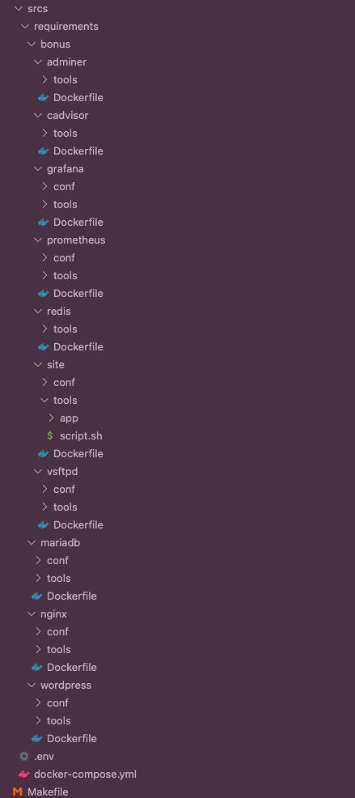
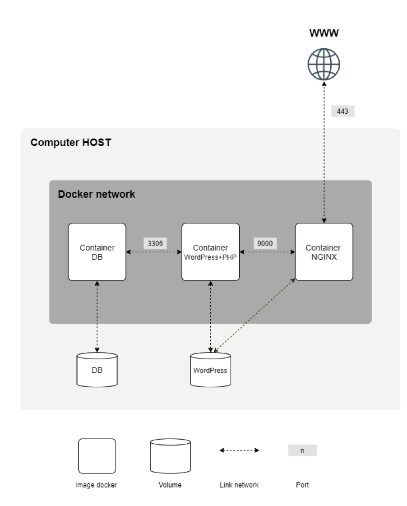
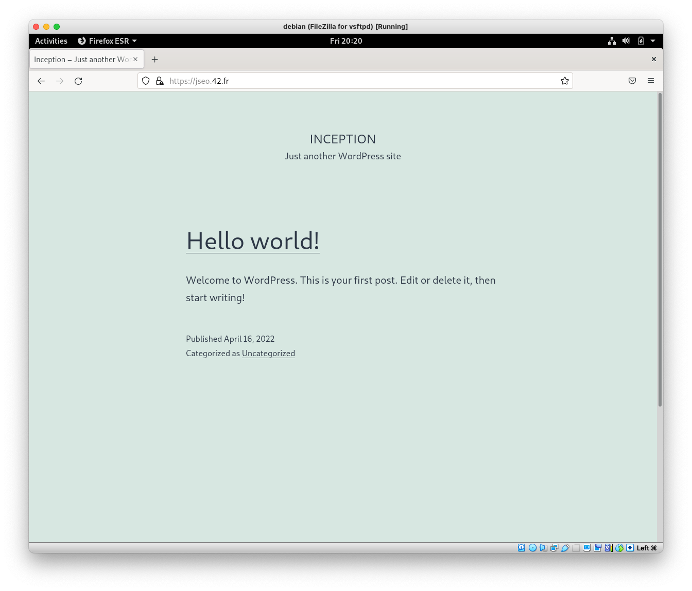
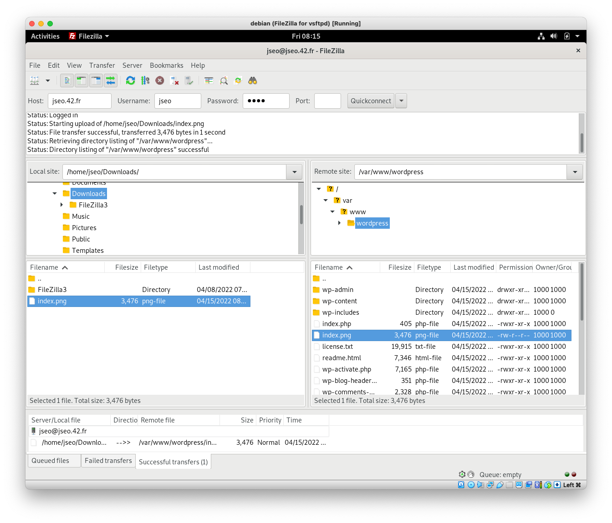
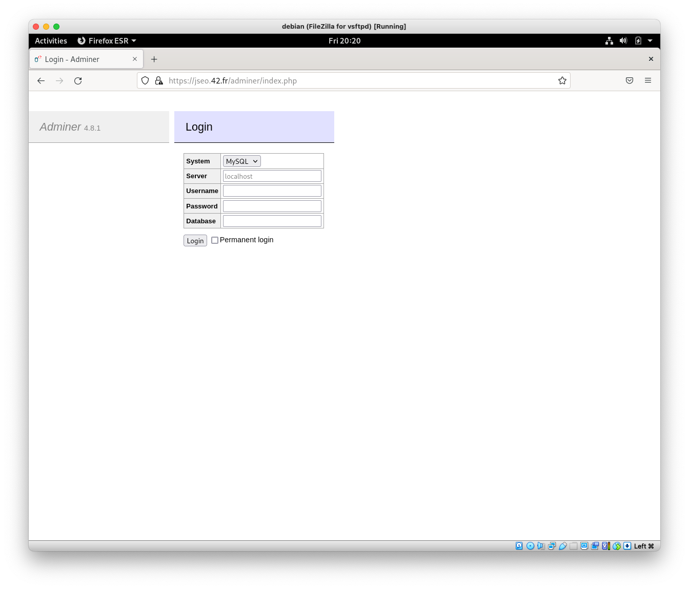
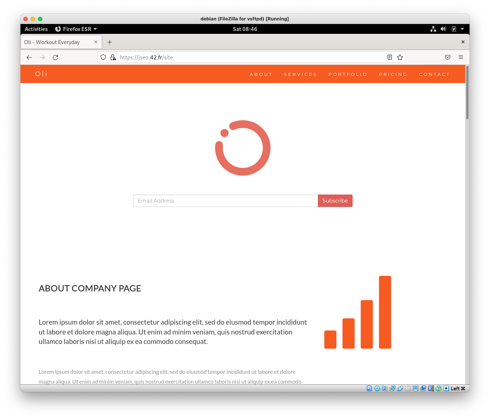
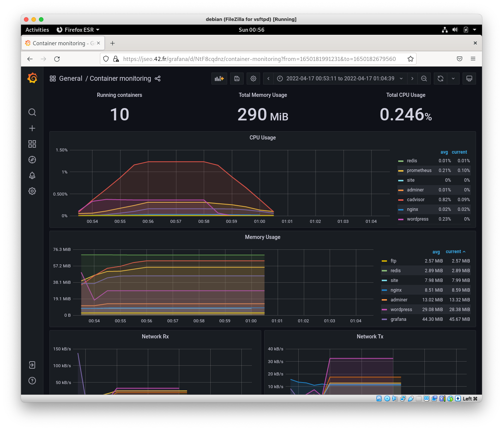

# 0. Subject & Guide Link

* [Subject](https://github.com/bigpel66/42-cursus/blob/main/circle-05/circle05%20-%20Inception.pdf)
* [Guide Link](https://bigpel66.oopy.io/library/42/inner-circle/20)

# 1. What is Inception?

It runs the Web Server which consists of Nginx, MariaDB, WordPress, each in a Docker Container. They are orchestrated by Docker Compose to give recovery plan when it is not running. Moreover, not only those services but also several services for assistance services are organized. Redis for WordPress caching, FTP for transfering file to remote, Adminer to control MariaDB on the website, another Personal Statis Website, Grafana & cAdvisor & Prometheus for collecting some data and serving.

# 2. How to run the implemented project?

First of all, Docker Compose should be install on your machine. When it is installed, run the follow rule of Makefile.
> make all

Also, `clean`, `fclean`, `re` is available. But another useful rules are `restart` to restart service containers without build, `log` to show logs on real-time, `ps` to show status of service containers.

# 3. Directory Structure?

\* Every detail is specified on `docker-compose.yml`.

    

# 4. Server Structure for Mandatory?

    

Also, Redis, FTP, Adminer, Personal Static Website, Grafana, Prometheus, cAdvisor are existing with separated networks.

# 5. Demo

    

    
    

    
    

