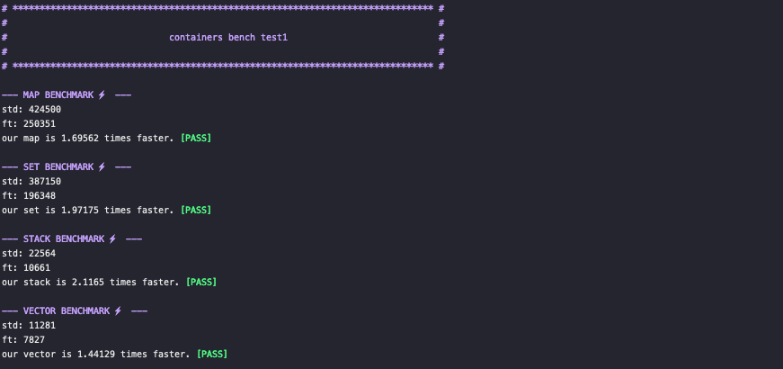
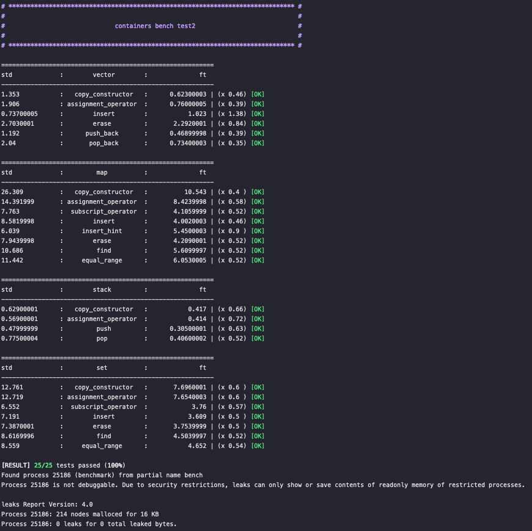

# 0. Subject

* [Subject](https://github.com/bigpel66/42-cursus/blob/main/circle-05/circle05%20-%20ft_containers.pdf)

# 1. What is ft_containers ?

This is the copy coded library of STL to understand the container + iterator system including template meta programming. Iterator & reverse iterator, vector, stack, set, map has been implemented. They behave like STLs and keep every result accordance with it.

# 2. How to compile the implemented program?

There is a `Makefile` which provides the common rule (all, clean, fclean, re) in the working directory. 

* For generating the binary file from the givin main.cpp on the intranet
> make all

* For testing the implemented containers (benchmark, diff, unit)
> make test

# 3. How to use the implemented program?

Just include the header files. The implemented things are totally in the header hpp files.

# 4. Features

1. Iterator system has been constructed random_access_iterator for vector, tree_iterator for map and set. They are totally depends on the iterator_traits to use the inner types.
2. Reverse iterator which is some kind of adaptor of iterator, also implemented as similar as STL one.
3. Every container is based on the C++98, and the member & non-member function is as similar as the original prototype.
4. To implement the map and set, RB tree has been used as a balanced tree model.
5. On the RB tree, end node and nil node are generated on the initial time. When the node inserted, it is located on the left child of the end node. The parent node of end is pointing nil, and the left, right, parent of nil is nil. On the traverse, the child of leaf node is nil.
6. This containers are faster than STL (almost 1.5x ~ 2x) on the average. On the unit aspect, every member & non-member function is at least 0.5 times faster than STL.

# 5. Demo

    
    
    
    

