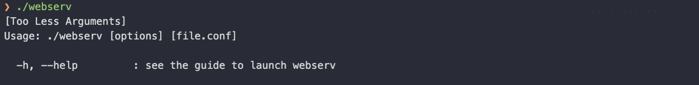
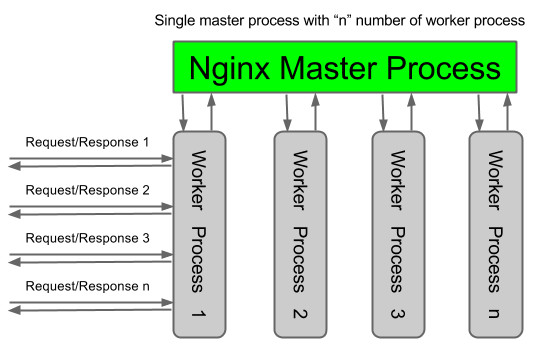
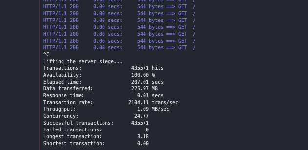
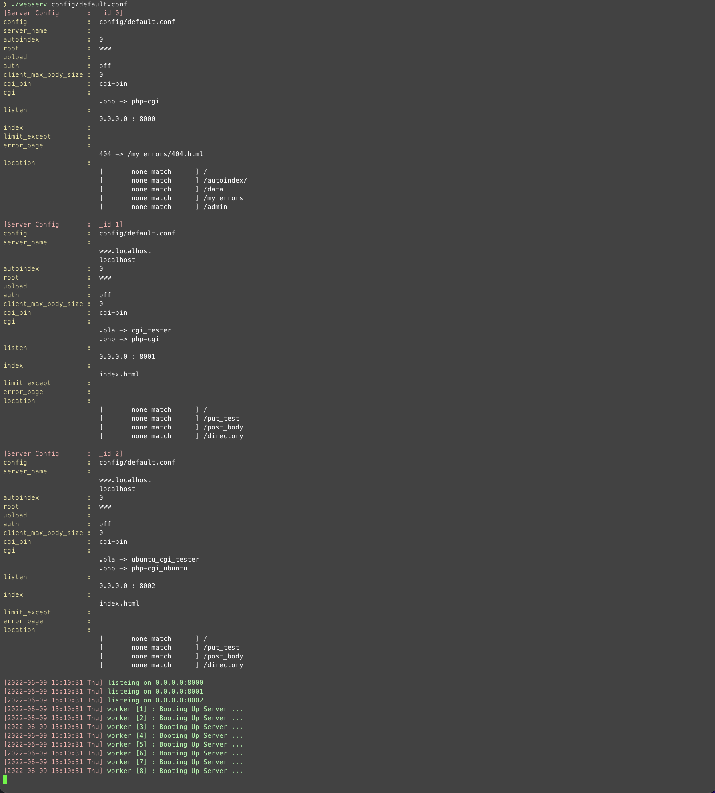

# 0. Subject

* [Subject](https://github.com/bigpel66/42-cursus/blob/main/circle-05/circle05%20-%20Inception.pdf)

# 1. What is Webserv?

This is the Web Server implemented by C++ just like Nginx. It takes the configuration file to run the server. When the server runs based on the configuration file, the server is able to serve the response as client requested. GET, HEAD, POST, PUT, DELETE methods are acceptable. When it is configured to use cgi, any cgi can be used. The purpose of this project is to understand not only the http/1.1, but also fundamentals of i/o multiplexing.

# 2. How to run the implemented project?

Just compile the project with the given Makefile.
> make

Originally, the program takes only an argument to run. Or, it shows the guide to run the program like the picture below. Thus, configure the configuration file before run the server.

    

Also, not only configuration file but also directories like `./www/YoupiBanane` should be setup to run the tester. In my case, `./config/default.conf` and `./www` has been used to run the tester.

# 3. Server Structure?

By using the pthread, it is almost as similar as Nginx. Nginx is run with the several processes which has been forked, but as the subject guidelines, webserv is run with the several threads based on the sole process.

Each of thread manage a single i/o multiplexing (in this case, select() system call).

Each of thread is so called as Worker in this source, the number of worker can be set from configuration file.

Worker threads can be set on the range 1 to 8.

    

# 4. What kind of directives this Web Server handles?

Every directive except `location` directive cannot be specified under `location` directive. (Inside `location` is ok.)

(1) workers : number of worker thread

    e.g.) workers number;

(2) server_name : specification the server name on the server block directive

    e.g.) server_name name1 name2 name3 ...;

(3) listen : bind the address and the port as specified (default is 0.0.0.0:80)

    e.g.) listen address[:port];
    e.g.) listen port;

(4) root : the root directory to handle the request

    e.g.) root directory_path;

(5) auth : authentication on the specific uri, must match given information

    e.g.) auth login:password;

(6) upload : the directory path to upload the files

    e.g.)upload directory;

(7) autoindex : options to list the files automatically when there's no matching uri (default is off)

    e.g.) autoindex on_or_off;

(8) index : files to be served as index (multiple files can be specified)

    e.g.) index file1 file2 file3 ...;

(9) error_page : the default error_pages to serve based on the given status codes

    e.g.) error_page status_code1 status_code2 status_code3 ... uri;

(10) cgi-bin : default cgi binary searching directory (default values is cgi-bin)

    e.g.) cgi-bin directory_path_based_on_root_directive;

(11) cgi : cgi binary to deal with the file which ends with specific extension

    e.g.) cgi extension cgi_path;

(12) location : set the path to handle specific uri from the server

    e.g.) location [ = | ~ | ~* | ^~ ] uri;

# 5. Bench Mark

    

(Above image is siege test.)

(Given tester from 42 Intra shows almost 70 - 80 seconds by using select system call to complete it.)

# 6. Demo

    

    

To test the some part of this web server, access `localhost:8000` which is run by `./config/default.conf` and run application `Postman` would be a great choice.
